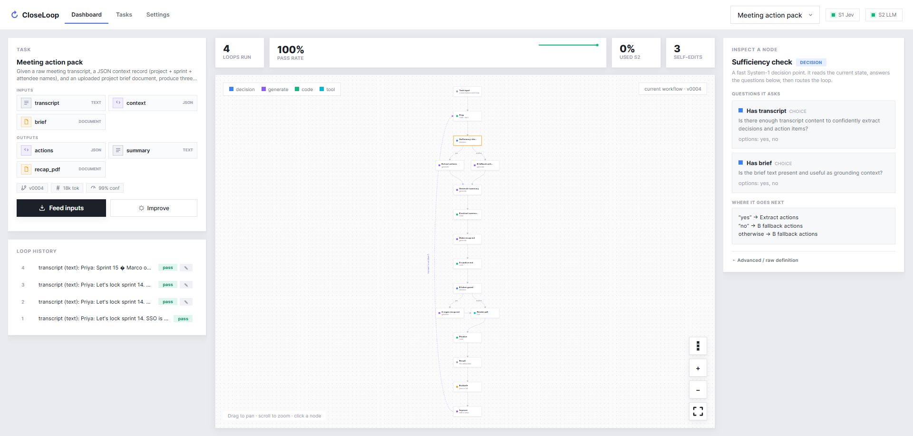

<p align="center">
  
</p>

# CloseLoop

**A self-improving workflow system utilizing the concept of system 1 and system 2 thinking. You define the input, the output, and how to score it. CloseLoop builds the workflow, runs it, grades itself, and rewrites its own workflow to do better next time.**

[](https://www.python.org/)
[](#-install)
[-339933.svg)](https://nodejs.org/)
[](REQUIREMENT.md)

<sub>Two models in a loop: a fast one that decides, a slow one that builds and improves.</sub>

---

CloseLoop runs one kind of task over and over, and gets better at it each time. You write the task in plain language and pick what goes in and what comes out. The system designs a workflow, runs each new input through it, scores the result, and edits the workflow when the score says it should. The full spec is in [REQUIREMENT.md](REQUIREMENT.md); what is actually built and verified is in [CHECKLIST.md](CHECKLIST.md).

## 🧠 The simple version

Think about learning to drive. At first you think hard about every action: mirror, signal, clutch, gear. That is slow and deliberate. After enough practice most of it becomes automatic reflex, and you only stop to think when something unusual happens.

CloseLoop works the same way, with two models playing the two parts:

| | Who | Speed | Job |
|---|---|---|---|
| **S1** | TypeSafe Jev (`jev.py`) | fast, cheap | The reflex. Judges, classifies, routes, and validates. It never writes text. |
| **S2** | an OpenAI LLM (`llm.py`) | slow, costly | The thinker. Writes content and code, handles the hard cases S1 escalates, and rewrites the workflow after seeing how recent runs went. |

The "reflexes" are written down as a **tree**: a workflow that S1 runs and S2 edits. Early on, S2 does most of the work. As the tree improves, S1 handles more of it alone and S2 steps in less. That is the whole point: the system converges toward running itself.

## 🔁 What one loop does

```
a new input (different every loop, same kind of task)
   │
   ▼
the tree
   ├─ S1 decides: route, gate, validate        (escalates hard cases to S2)
   ├─ S2 writes: content and code
   └─ tools: render a doc, a chart, run code, call an API
   │
   ▼
the output  ──►  scored against your metric
   │
   ▼
S2 reviews recent runs  ──►  rewrites the tree, or leaves it alone
```

## ✨ Features

- **You define the task, the system builds the workflow.** Describe it in plain language, pick the input and output, and S2 drafts the first workflow for you.
- **More than one input or output.** A task can take several inputs and produce several outputs, each with its own type.
- **Real files in and out.** Text, JSON, tables (CSV / Excel), and documents (PDF / DOCX). Upload a file, download the result. Image and audio are wired in through OpenAI tools.
- **It grades every result.** Each output is checked against your metric: a code check, a fast S1 check, and an optional deeper S2 review. The task passes only when every output passes.
- **It improves itself.** After each run S2 looks at what happened and either rewrites the workflow or leaves it alone. Every edit is driven by real results, not guesses.
- **Bad edits never go live.** Before any new workflow runs, it has to pass validation and a strict TypeScript type-check. A workflow that does not compile is rejected.
- **Versioned and reversible.** Every edit is a new version with a reason. You can pin a version, roll back, or freeze a good run so future edits are not allowed to break it.
- **You can watch it converge.** Pass rate, escalation rate, edit count, confidence, and cost, all shown live.
- **A visual canvas.** Inputs on the left, the live tree in the middle, outputs on the right, plus run history and a node inspector. One self-contained HTML page.
- **Live only, no setup tax.** The Python side is standard library only. Nothing to `pip install`.

## 📦 Install

You need **Python 3.10+** (standard library only, nothing to install) and **Node 23+** to run code steps. `npm install` adds `tsc` for the type-check gate.

```bash
cp config.example.json config.json   # then put your Jev + OpenAI keys in it
python run.py                         # serves the UI at http://127.0.0.1:8642
```

`config.json` is the source of truth for keys and models. There is no mock mode: a missing key stops the server on purpose.

## 🚀 Usage

1. Click **New task**, describe what you want in plain language, and set the input and output. S2 drafts the workflow; adjust it and confirm.
2. Give it an input (a text box, a JSON editor, or a file) and run. Or click **auto-stream** to have S2 make new, distinct inputs of the same kind and run a batch.
3. Open any run to see its trace and scores, browse versions, roll back, or pin a run as a safety fixture.

Every loop uses a different input, so a fix that only works on one memorized case does not count as an improvement.

## ⚙️ How it works

1. **S1 decides, S2 builds.** S1 only judges and routes with calibrated confidence. Anything that needs writing (content, code, the workflow itself) comes from S2. The loop is owned by code, not by a model.
2. **Nothing risky ships unchecked.** The compile gate (validation plus a strict TypeScript type-check) is what makes an auto-written workflow safe to deploy.
3. **Improvement is editing the workflow, not training a model.** S2 changes the steps between runs. Your input, output, and metric stay fixed. Only the internals move.

## 🔒 Good to know

- This is a research prototype. Code steps run on Node with a trimmed environment, not a hardened sandbox, so do not run workflows you do not trust.
- Image and audio tools (vision, transcription, image generation, speech) are wired up but not yet run live.
- `REQUIREMENT.md` and `CHECKLIST.md` are the source of truth. If anything above disagrees with them, they win.
